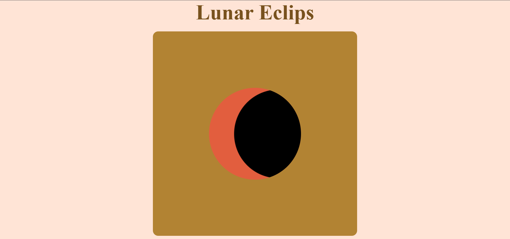

# Lunar Eclipse Animation 🌑🌕

This is a mini front-end project that visually represents a **lunar eclipse** using HTML and CSS. The animation is created using smooth transitions to simulate the moon covering the sun.

##  Features
- Pure HTML & CSS (no JavaScript)
- Simple design
- Responsive design
- Animated eclipse effect using '@keyframes'
- Beginner-friendly project for learning CSS animations

##  Technologies Used
- HTML5
- CSS3 (with '@keyframes', 'border-radius', 'animation', etc.)

## 🔍 Preview

"If you use this project, feel free to ⭐ it or let me know — I'd love to see your work!"

